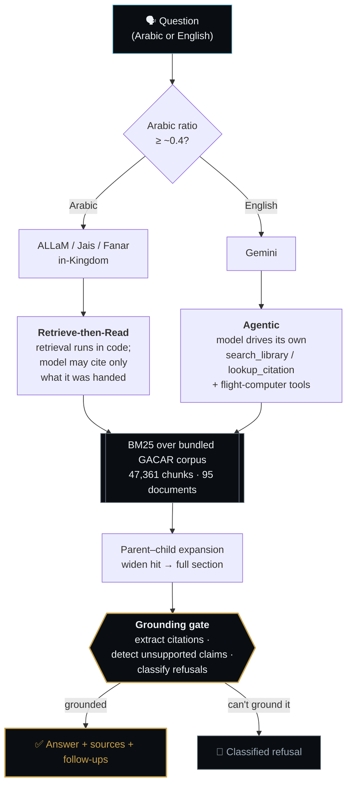
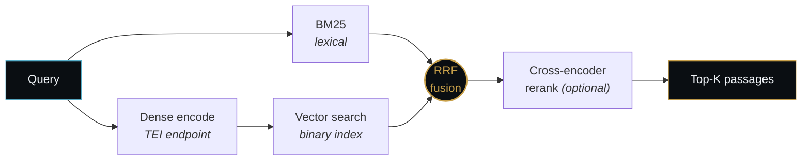

<div align="center">


# Captain Adel

**The AI flight instructor that refuses to guess.**

Grounded GACAR answers for Saudi civil aviation — in Arabic and English, with the Part and section cited every time.

<p>
  <a href="https://github.com/FlyGACA/Captain-Adel/actions/workflows/ci.yml"></a>
  <a href="test/"></a>
  <a href="package.json"></a>
  <a href="https://captadel.com"></a>
  <a href="https://huggingface.co/spaces/flygaca/captain-adel"></a>
  <a href="LICENSE"></a>
</p>

[**Try it live**](https://captadel.com) · [Quickstart](#-quickstart) · [Architecture](#-how-it-works) · [Hugging Face](#-on-hugging-face) · [Roadmap](ROADMAP.md)

</div>

> [!IMPORTANT]
> **Unofficial & educational.** Captain Adel is not affiliated with, endorsed by, or operated by GACA. The authoritative source for any regulation is always official GACA publications at [gaca.gov.sa](https://gaca.gov.sa). Not for operational decisions.

---

## Why this exists

Ask a general-purpose chatbot about Saudi aviation regulations and it will confidently invent a section number. Captain Adel won't — it retrieves the actual GACAR text first, answers **only** from what it found, and refuses when it can't ground the claim.

|  | |
|---|---|
| 🎯 **Cite or refuse** | Every claim traces to a real Part and section. No passage, no answer — refusals are classified, not improvised. |
| 🌍 **Arabic-first, genuinely** | Arabic queries route to in-Kingdom Arabic models over a retrieve-then-read pipeline, with Arabic normalization baked into the lexical index. |
| 🇸🇦 **PDPL by design** | Real user questions are personal data. Production inference runs in-Kingdom (`me-central2`), not on someone else's GPU. |
| 🧠 **One brain, many surfaces** | `src/brain/` is the single source of truth — it powers captadel.com, the Fly GACA platform API, the exam engine, and the evals. |
| ✈️ **Compute that isn't hallucinated** | Wind, fuel, weight & balance, recency and density altitude run as real functions, then deep-link to the matching calculator. |
| 🔬 **Eval-gated** | 138 regression cases across 31 GACAR Parts in both languages. A provider doesn't ship until it match-or-beats the incumbent. |

---

## ⚡ Quickstart

```bash
git clone https://github.com/FlyGACA/Captain-Adel.git && cd Captain-Adel
npm install
cp .env.example .env          # add your GEMINI_API_KEY
npm start                     # → http://localhost:8787
```

Ask it something:

```bash
curl -X POST http://localhost:8787/v1/chat \
  -H 'Content-Type: application/json' \
  -d '{"message":"What are the basic VFR weather minima in Class E airspace?"}'
```

<details>
<summary><b>What comes back</b></summary>

```json
{
  "answer": "Under GACAR Part 91, §91.155, basic VFR flight rules require...",
  "sources": [{
    "citation": "GACAR Part 91, §91.155",
    "title": "Basic VFR Weather Minima",
    "url": "https://flygaca.com/library/gacar-part-91#91.155"
  }],
  "kind": "grounded",
  "refusalClass": null,
  "suggestions": ["What are the VFR visibility requirements at night?"],
  "meta": { "provider": "gemini", "model": "…", "rewrittenQuery": "…", "toolCalls": [] }
}
```

`kind` is one of `grounded` · `partial` · `refusal` · `na`. Stream it with `?stream=1` or
`Accept: text/event-stream`. The contract version is echoed as `X-Adel-Api-Version`.

**Other endpoints:** `GET /health` · `POST /v1/feedback` (rating only — never the question or answer) ·
`/v1/me`, `/v1/config`, `/v1/billing/*` · `POST /v1/account/delete`

</details>

---

## 🧭 How it works

Two answer strategies, picked by language and provider:



The grounding gate is the whole product. `structural` mode (regex, no network) is the default;
`ADEL_GROUNDING=faithfulness` swaps in a per-claim LLM judge.

<details>
<summary><b>Optional hybrid retrieval — dense + rerank</b> (off until endpoints are configured)</summary>

BM25 alone is strong for English and weak for Arabic queries against an English corpus. The hybrid
path adds a cross-lingual dense retriever and fuses the two rankings:



```env
EMBEDDINGS_BASE_URL=http://localhost:8080          # TEI or compatible — OFF until set
EMBEDDINGS_MODEL=Qwen/Qwen3-Embedding-0.6B
RERANK_BASE_URL=http://localhost:8081              # OFF until set
RERANK_MODEL=Alibaba-NLP/gte-multilingual-reranker-base
ADEL_PARENT_CHILD=on                               # default
```

The dense index is a **build artifact, not committed** — `npm run build:embeddings` writes
`src/brain/_embeddings.bin` (binary, `0xADEF0001` header, Matryoshka dimension truncation) with a
legacy `_embeddings.json.gz` path still supported. Embeddings only ever see the public corpus, so
they carry no in-Kingdom residency constraint.

</details>

---

## 🤖 Models

| Provider | Strategy | Role |
|---|---|---|
| **Gemini** | Agentic function-calling | Default English path & tool caller |
| **ALLaM-7B-Instruct** · HUMAIN | Retrieve-then-read | Primary in-Kingdom Arabic model · *Apache 2.0* |
| **Jais 13B / 30B** · Inception G42 | Retrieve-then-read | Arabic reasoning candidate |
| **Fanar** · QCRI | Retrieve-then-read | Arabic regulatory candidate |
| **Qwen 2.5 Instruct** · Alibaba | Retrieve-then-read | Instruction-following workhorse · *Apache 2.0* |
| **Command R** · Cohere | Grounded-citation | Research & eval baseline · *CC-BY-NC* |

Routing: Arabic character ratio ≥ ~0.4 (after stripping VFR/IFR/METAR-style acronyms) → first
configured Arabic provider, else Gemini. Fallback runs both directions. Promoting a candidate to
`MODEL_PROVIDER=auto` requires clearing the **parity gate** (`npm run eval:parity`).

---

## 🤗 On Hugging Face

Cross-lingual retrieval is the open thread — pure-Arabic queries score near-zero BM25 hits against
an English corpus, and dense retrieval is how that gets unlocked. Work in the open:

| Repo | What it is | Status |
|---|---|---|
| [`flygaca/CaptAdel`](https://huggingface.co/flygaca/CaptAdel) | Bilingual GACAR retrieval embedder | 🚧 **Weights not yet published** — base model TBD |
| [`flygaca/gacar-assistant-evals`](https://huggingface.co/datasets/flygaca/gacar-assistant-evals) | Bilingual query → expected-Part eval set | 🌱 Seed — 24 questions (12 EN + 12 AR mirrors) |
| [`flygaca/captain-adel`](https://huggingface.co/spaces/flygaca/captain-adel) | Gradio demo Space | ✅ Deployed |

**In this repo, ready to run:**

```bash
node evals/ablations.js                   # compare retrieval configs (needs an embeddings endpoint)
python3 scripts/export-training-pairs.py  # → evals/training-pairs.jsonl (66 contrastive pairs)
EPOCHS=3 BATCH_SIZE=32 LEARNING_RATE=2e-5 HF_TOKEN=… python3 scripts/finetune-embedder.py
```

The Space is a **public demo over the public corpus** — it is not the production path and carries no
in-Kingdom guarantee. Production inference stays in KSA — see **Deployment & data residency** below.

> [!NOTE]
> **No retrieval numbers are published yet.** The pipeline, the 66 mined training pairs and the
> ablation harness are in place, but the embedder has not been trained and the ablations have not
> been run against a live endpoint — so there is no measured recall or MRR to report. Target metrics
> live in [`docs/phase-3-fine-tuned-embedder.md`](docs/phase-3-fine-tuned-embedder.md); the tables
> there are **illustrative report shapes, not results**. This section gets numbers when the runs happen.

---

## 🗂 Repository map

```
landing/          captadel.com marketing site (Vite + React, EN + /ar/) → Cloudflare Worker, manual deploy
public/           The app: chat · exam · account · console · checkout · legal (8 pages, 16 JS modules)
src/
  server.js       Express entry — routes, hand-maintained CSP, CORS, rate limit, quota
  middleware/     Firebase auth · CORS allowlist · API-key (trusted tier)
  billing/        Moyasar + Firebase SaaS layer (dark until env is set)
  quota/          Firestore usage meter — fails open, always
  brain/          🧠 THE BRAIN — portable, dependency-light, shared with the evals
    answer.js         orchestrator: provider → strategy
    route.js          language detection + provider routing
    retrieve.js       retrieve-then-read (BM25 + optional dense/rerank)
    bm25.js           lexical index + Arabic normalization + aviation synonyms
    grounding.js      cite-or-refuse: claims, refusal classes, source shaping
    embeddings.js     dense + reranker clients (optional)
    guards.js         input validation, size caps, soft injection detection
    system-prompt.js  composed instruction (product-neutral core)
    providers/        gemini (agentic) + openai-compatible factory (allam/jais/fanar/qwen/commandr)
    tools/            compute-only: wind · fuel · W&B · recency · density altitude
    _chunks.json.gz   bundled GACAR corpus — 47,361 chunks across 95 documents
test/             43 files, 496 tests — node:test, no keys, no network
evals/            regression harness: cases.json (138 cases) · run.js · parity.js · ablations.js
docs/             architecture specs, model catalog, refusal taxonomy, runbooks
```

---

<details>
<summary><b>🛠 Development — scripts, the pre-push gate, evals</b></summary>

```bash
npm run smoke            # server module loads (no keys) — CI-safe
npm run smoke:frontend   # static audit of public/*.html: chrome, script order, DOM hooks
npm run test:unit        # 496 tests, deterministic, no network
npm run eval:dry         # validate evals/cases.json structure
```

**Before pushing** — this is what the deploy gate runs without secrets:

```bash
npm run smoke && npm run smoke:frontend && npm run test:unit && npm run eval:dry
```

Live evals need real keys and hit the model:

```bash
GEMINI_API_KEY=… npm run eval                      # full regression suite
ALLAM_BASE_URL=… npm run eval:allam                # one provider
npm run eval:parity                                # gates MODEL_PROVIDER=auto
```

There is **no eslint/prettier** — style is convention and review. Match the surrounding code.

</details>

<details>
<summary><b>🔒 Deployment & data residency — PDPL, Cloud Run, container specs</b></summary>

Saudi **PDPL** treats real user questions as personal data, so the chat model must run in-Kingdom
for production:

- Node service → **Google Cloud Run, `me-central2`** (`me-central1` fallback), secrets from Secret Manager
- Arabic endpoints (ALLaM / vLLM) → inside KSA infrastructure
- HF / US / EU endpoints are fine for **dev and evals only**
- Embeddings see only the public corpus → no residency constraint

Container: `node:20-slim`, port `8787`, **≥2 GiB RAM** (the BM25 index is resident).
Runbooks: [`deploy/allam-vllm.md`](deploy/allam-vllm.md) · [`docs/RUNBOOK-captadel-deploy.md`](docs/RUNBOOK-captadel-deploy.md) · [`docs/RUNBOOK-arabic-provider.md`](docs/RUNBOOK-arabic-provider.md)

</details>

---

## 🌐 The Fly GACA family

[**The Book of Fly GACA**](https://github.com/ay2m/FlyGACA/blob/main/THE-BOOK-OF-FLY-GACA.md) is the whole-family reference — all repos, shared tenets, and the glossary.

- [**Captain-Adel**](https://github.com/FlyGACA/Captain-Adel) — this repo · the instructor & shared brain
- [**FlyGACA-app**](https://github.com/FlyGACA/FlyGACA-app) — the web PWA (`flygaca.com`)
- [**ay2m/FlyGACA**](https://github.com/ay2m/FlyGACA) — native iOS family
- [**FlyGACA/Office**](https://github.com/FlyGACA/Office) — business, legal, compliance

---

<div align="center">

**Engineered for flight safety. Grounded, or it doesn't ship.**

Direction and open threads live in [`ROADMAP.md`](ROADMAP.md). Every change is eval-gated.

</div>
